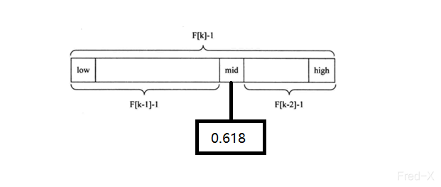

算法部分为 Sorting,Searching,Recursion,Backtracking,DP,DFS,BFS,Union Find Big O,Time vs space

## 算法的核心要义

**数据结构的存储核心就是两种：数组（顺序存储）和链表（链式存储）**
数组和链表才是数据结构的基础，至于其他的数据结构如散列表，栈，堆，树，图等都可以归结为链表和数组上的特殊操作。
比如说队列和栈，就可以用链表或者数组进行实现。用数组实现，那么就需要处理扩容和缩容的问题，用链表实现，就没有扩容缩容的问题，但是需要更多的内存空间存储节点指针。
数组和链表的优缺点如下

数组由于是紧凑连续存储，可以随机访问，可以通过索引快速找到对应的元素，而且相对节约内存空间。但是正因为连续存储，内存空间就必须一次性的分配够，所以说数组要扩容就需要重新分配一块更大的内存空间，再把数据全部复制过去，时间复杂度 O(n)，而且你在数组中想要在数组中间进行插入和删除，就必须每次搬移后面的所有数据以保持连续，时间复杂度 O(n)

链表因为元素不连续，而是靠指针指向下一个元素，所以不存在数组上面遇到的扩容的问题，如果知道某一个元素的前驱和后驱，操作指针就可以删除该元素或者插入新的元素，时间复杂度 O(1)，但是正是因为但存储空间不连续，你无法根据一个索引计算出对应元素的地址，所以不能随机访问，而且由于每个元素必须存储指向前后元素位置的指针，会消耗相对更多的存储空间。

### 数据结构的基本操作

对于任何种类的数据结构，无非就是遍历和操作也就是增删改查。
数据结构的种类有很多，但是他们存在的目的都是在不同的应用场景尽可能的完成高效的增删改查。
各种数据结构的遍历+访问无非是两种形式：线性的和非线性的。
线性的就是 for/while 迭代为代表的。非线性的就是递归为代表的。
所谓的框架，就是套路，不管增删改查，这些代码都是永远无法脱离的结构，你可以把这些结构作为一个大纲，根据具体的问题在框架上添加代码就可以。

## Sorting

排序算法有很多，最简单的就要数冒泡了，这个就不写了很简单。
目前我查到的 v8 在长度小于 10 的 时候是采用的插入排序，当大于 10 的时候采用的是插入排序，因此在这里就重点掌握这两种排序的算法。

### 插入排序

插入的工作原理是通过构建有序的序列，对没有排序的数据，在已经排序的序列中从后向前扫描，找到相应的位置并插入。插入排序在实现上通常是采用 in-place 排序，既只需要用到 O(1)的额外空间的排序。因而在扫描的过程中，需要反复把已经排序的元素逐步向后进行位移，为最新元素提供插入空间。
一般来说算法的实现是这样的

1. 从第一个元素开始，元素被认为是已经被排序。
2. 取出下一个元素，在已经排序的元素中从后向前扫描。
3. 如果该元素（已排序）大于新元素，将该元素移动到下一个位置。
4. 重复步骤 3 ，直到找到已经排序的元素小于或者等于新元素的位置。
5. 将新元素插入到该位置后。
6. 重复步骤 2~5

**插入排序的算法复杂度**
如果是把 n 个元素的序列进行升序排列或者降序排序，那么插入排序就存在着最好和最坏的情况，最好的情况是序列已经是升序排序了，在这种情况下，需要进行的比较操作是 n-1 即可。最坏的情况就是序列是降序排列，那么此时需要进行的比较就是 $\frac{1}{2}$n(n-1)，插入排序的赋值操作是比较操作的次数减去 n-1 次，因为在 n - 1 循环中，每一次循环的比较都比赋值多一个，多在最后的那个比较并不能带来赋值。平均来说插入排序的算法复杂度是 O($n^2$)。所以插入排序不适合大量的数据，当数据是千这个级别的时候，比较适合。或者数据是有一定的规律。
以下是代码算法实现。

```js
/**
 * @description
 * @author lipc
 * @date 18/03/2021
 * @param {Array<number>} params,需要排序的数组
 * @param {number} len,当前的第几个元素。
 * 1 从第一个元素开始，就默认这个元素是排好序的了
 * 2 取出下一个元素，在已经排序的元素中从后向前扫描
 * 3 如果该元素，大于新元素，将该元素移动到下一个位置
1. 从第一个元素开始，元素被认为是已经被排序。
2. 取出下一个元素，在已经排序的元素中从后向前扫描。
3. 如果该元素（已排序）大于新元素，将该元素移动到下一个位置。
4. 重复步骤 3 ，直到找到已经排序的元素小于或者等于新元素的位置。
5. 将新元素插入到该位置后。
6. 重复步骤 2~5
 */
function insert(params) {
  // 默认的第一个元素是 数组的最后一个元素。
  for (let i = 0; i < params.length; i++) {
    for (let j = i; j > 0; j--) {
      // 这里是比较关键的地方，跳出的条件和循环的条件。
      if (params[j] > params[j - 1]) {
        // 这里是将 j 前面的所有的元素当做是一个新的数组，在这个数组中进行排序，因为排序是从 0 开始的
        // 可以认为每次开始之前的排序是都做好的，所以只需要对比一次就可以确定位置
        const tmp = params[j];
        params[j] = params[j - 1];
        params[j - 1] = tmp;
      }
    }
  }
  return params;
}
```

### 快速排序

快速排序使用了分治法策略来把一个序列分为较小和较大两个子序列，然后递归的排序这两个子序列。

1. 挑选基准值：从数列中选择一个元素，称之为 “基准”（pivot）
2. 分割：重新排序子序列，所有比基准值小的放在左边，比基准值大的放在右边，于基准值相等的可以不变，这个分割结束以后对于基准值的分割就结束。
3. 递归排序子序列：递归的将步骤 2 排序好的左右序列进行递归排序。

递归到底部的判断条件是数量的大小是零或者一，此时的数列是已经有序的。
选取基准值对算法的性能有一定的影响。
在 V8 的 sort 算法中选择的是插入和快排，数量小的时候采用插入，数量大的时候选择的是快排。这是因为快排是一种最佳和平均时间复杂度都可以是$xlog(x)$,是一种应用非常广泛的排序算法。
快排的核心就是不断的把数组进行切分，切分成小数组以后继续将小数组进行切分。

代码实现

```js
function quickBase(arr) {
  if (!arr || !arr.length) return [];

  // 中断递归的条件
  if (arr.length < 2) return arr;

  // 基准值的选择,基准值的选择有很多的方案,有的是直接选择的数组开头的值，有的是选择的数组最后的值
  // 随机
  // const pivot = Math.floor(Math.random() * arr.length)
  // 开头
  // const pivot = 0
  // 结尾
  const pivot = arr.length - 1;

  // 声明左右数组，大的往 big 走，小的往 small 走
  const smallArray = [];
  const bigArray = [];
  // 按照 pivot 的值选择数据
  for (let index = 0; index < arr.length; index++) {
    // 相等的可以放到大的组也可以放到小的组
    if (arr[pivot] >= arr[index] && index !== pivot) {
      // 大的值进大的数组
      bigArray.push(arr[index]);
    }

    if (arr[pivot] < arr[index] && index !== pivot) {
      // 小的值进小的数组
      smallArray.push(arr[index]);
    }
  }
  return [...quickBase(bigArray), arr[pivot], ...quickBase(smallArray)];
}
```

上面的算法实现是一个很基础的版本，还有很多是社区里改进的版本。这里就不做更新了。

经过我的实际测算，pivot 对算法的时间有很大的影响，当 pivot 选择是 0 的时候，是时间消耗最大的，当是 10000 个 random 以后的数组的时候，pivot === 0 的时候耗时是 pivot === arr.length 的两三倍。可能的原因是分治不生效，时间复杂度就会上升，耗时就会增加。或者是 random 的生成的是以一种很特殊的规律在分布，而 0 开始的时候可能是相对逆序。

调查了一下，当面对很大的数据量的时候快排的效率不是最好的，但是 v8 还是采用这个，可能和前端的场景有关系，但是 node.js 应该会遇到很大的排序场景的吧，或者这是一种平衡的选择，对于很大数据排序这种是很小众的需求，没有考虑进去？我猜测是这样的。

### 堆排序

[堆排序 heap](./Sort/heap.js)
堆排序是利用堆这种数据结构而设计的一种算法，堆排序是一种选择排序，他的最好最坏的平均时间复杂度是 O($n\log(n)$)，堆排序也是一种不稳定排序。

**堆**：堆是具备以下性质的完全二叉树，在数据结构的学习过程中看到过一篇文章，写的是所有的数据都是可以归结成数组（顺序存储）和链表（链式存储），二叉树就是一种链表，比如说 (6, 5, 4, 3, 2, 1) 这个二叉树画下来就是一个链表，当然二叉树也可以用数组实现，核心其实是一样的，但是组成的方式是不一样的。

原本这里排序算法是掌握了插入和快排以后就先搁置的，但是项目里正好有个需要排序的实践场景，可以使用四种排序手法，所以这里再更新两种排序方案，加入堆排序。

**大顶堆**：每个结点的值都是大于或者等于它的左右孩子树的值，叫做大顶堆。
**小顶堆**：每个结点的值都是小于或者等于它的左右孩子的值，叫做小顶堆。
上面的语句翻译成代码就是

```js
// 大顶堆
arr[i] >= arr[2i] && arr[i] >= arr[2i+1]

// 小顶堆
arr[i] <= arr[2i] && arr[i] <= arr[2i+1]
```

**堆排序的基本思想**：将待排序的序列构造成一个大顶堆，此时整个序列的最大值就是大顶堆的根节点，将其与末尾元素交换，这样末尾的值就是最大值，然后继续将前面的 n-1 个值再次组成一个大顶堆，这样就得到一个 n-1 个值的大顶堆，然后继续上面的操作，直到数组的长度是 1。

**构建堆：** 构建堆的时候，要使用到上面说的堆的特性，也就是 `arr[i] >= arr[2i] && arr[i] >= arr[2i+1]` 这个条件，当满足的时候就交换值。

```js
/**
 * @description 堆排序
 * @author lipc
 * @date 29/03/2021
 * 1 构造堆，一般降序是大顶堆，升序是小顶堆
 * 2 交换第一和末尾的值，继续在 0 ~ n-1 个值中构造堆
 * 3 重复 1 2 直到数组长度是 1 。
 * @param {*} params
 */
function heap(arr) {
  // 中断递归
  if (arr.length < 2) {
    return arr;
  }

  const heapFactoryArray = heapFactory(arr);
  const shift = heapFactoryArray.shift();
  return [...heap(heapFactoryArray), shift];
}

/**
 * @description
 * @author lipc
 * @date 30/03/2021
 * @param {*} arr 需要交换的目标数组
 * @param {*} i 交换的值
 * @param {*} j
 */
function swap(arr, i, j) {
  const temp = arr[i];
  arr[i] = arr[j];
  arr[j] = temp;
}

/**
 * @description 构建堆，当堆顶的元素是最大的时候，就是大顶堆，当堆顶的元素是最小的时候，就是小顶堆
 * @author lipc
 * @date 30/03/2021
 * @param {*} arr
 * ! 堆是这样的一个完全二叉树，父节点总是大于或者等于左右孩子节点。这是大顶堆
 * ! 父节点总是小于或者等于左右孩子节点，这是小顶堆
 * ! 完全二叉树，除了最后一层，别的节点都是满的，完全填充，
 * 如何构造一个堆？
 * 1 先构造一个完全二叉树
 * 2 然后将二叉树数据移动，完成一个堆
 *
 * 1 怎么构造一个完全二叉树
 * 完全二叉树是
 */
function heapFactory(arr) {
  const size = arr.length;

  function maxHeapify(i) {
    let max = i;

    // 中断递归
    // 这里的 i 不能比数组的长度更大
    if (i >= size) {
      return;
    }

    const left = i * 2 + 1;

    const right = i * 2 + 2;

    // 当前节点和左右节点哪个大，当当前节点小于左右的时候，就交换值
    if (left < size && arr[left] > arr[max]) {
      // 调整小顶对的时候这里变成小于
      // 这时候当前的节点的值小于左边孩子值。
      max = left;
    }

    if (right < size && arr[right] > arr[max]) {
      // 调整小顶对的时候这里变成小于
      // 当前节点的值小于右孩子值。
      max = right;
    }

    // 这时候 max 就是自己，终止递归
    // 既不满足大于左孩子又不满足大于右孩子，那么就是自己，这里必修做中断，要不然会成死循环
    if (max === i) {
      return;
    }

    const temp = arr[i];
    arr[i] = arr[max];
    arr[max] = temp;

    return maxHeapify(max);
  }

  // 我们通过 for 循环递归调动 maxHeapify 函数，就可以构建一个完全二叉树出来，但是我们需要一个堆，那么对于堆来说需要调整上面的完全二叉树
  // 完全二叉树的叶子节点是不需要调整的，需要调整的是非叶子节点，那么在完全二叉树中非叶子节点是 数组的长度/2取整数，那么在这个数字之前的值，就是需要我们做调整的值

  // 这里是比较关键的地方，我们需要构建一个大顶堆出来，这时候就需要处理中间的叶子节点。

  const unLeafIndex = Math.floor(arr.length / 2);

  for (let i = unLeafIndex; i >= 0; i--) {
    maxHeapify(i);
  }

  // 注释掉的这个循环就会做一个完全二叉树出来，这个循环会处理所有的节点，包括叶子节点和根节点，上面的循环就是只处理非叶子节点
  // for (let index = 0; index < arr.length; index++) {
  //     maxHeapify(index)
  // }

  return arr; // 这时候，就获取了一个大顶堆，如果要小顶堆的话就把上面的值变成小于
}
```

## Searching

### 斐波那契查找/黄金分割查找

(Fibonacci search)[Fibonacci search](./Searching/fibonacci.js)

这个算法好绕啊，光看算法的思想就要好一会。先简单写一下算法的思想

fibonacci 算法和二分法以及插值查找比较相似，仅仅是改变了中间的值的选择， mid 不再是中间值或者插值得到，而是位于黄金分割点附近，也就是 mid = low + f(k-1)-1，f 代表斐波那契数列，如上图所示。

### 二分查找法 Binary search algorithm

先暂时搁置斐波那契查找，将二分法吃透，吃透了以后再去吃透 斐波那契查找。
二分查找在算法中属于分治法，基本分治法的算法都是可以用递归来完成的。
[二分查找法 Binary search algorithm](./Searching/binarySearch.js)
二分法有个适用对象是一堆有序的数组，也就是使用的前提：

1. 有序
2. 数组

时间复杂度按优劣排差不多集中在：
O(1), O(log n), O(n), O(n log n), O(n2), O(nk), O(2n)

```js
/**
 * @description
 * @author lipc
 * @date 23/03/2021
 * @param {*} arr 目标数组，有序的目标数组
 * @param {*} low 范围的左侧小的那个值
 * @param {*} high 范围的右侧，大的那个值
 * @param {*} target 目标值。
 */
function binarySearch(arr, low, high, target) {
  if (low > high) {
    return -1;
  }

  // 计算出中间值，取整
  const mid = Math.floor((low + high) / 2);

  // 当 arr[mid] > target 说明当前的中间值大于目标值，我们的数组是有序数组，
  // 也就是当前的数组 mid 后面的所有值，都是大于目标值，所以后面的值不需要比较
  if (arr[mid] > target) {
    return binarySearch(arr, low, mid - 1, target);
  } else if (arr[mid] < target) {
    // 如果是当前的mid值小于目标值，那么说明当前mid 值的左边所有的值都是小于
    // 目标值的，那就是需要去后面大的值里去查找
    return binarySearch(arr, mid + 1, high, target);
  } else {
    return mid;
  }
}

/**
 * @description 所有的递归是都可以采用自行定义 stack 来解递归的，所以二分法也是可以不采用递归实现，
 * 因为二分法实际上是尾递归，它不关心递归前的所有信息
 * @author lipc
 * @date 23/03/2021
 * @param {*} arr 目标数组，有序的目标数组
 * @param {*} low 范围的左侧小的那个值
 * @param {*} high 范围的右侧，大的那个值
 * @param {*} target 目标值。
 */
function binarySearchTailRecursive(arr, low, high, target) {
  // 尾递归的思想
  while (low <= high) {
    // 还是同样的思想，当 arr[mid] > target 的时候，说明要在左边查找，那么就修改 high 的值
    let mid = Math.floor((low + high) / 2);
    if (arr[mid] > target) {
      // 这时候的 high 就变成了 mid -1；
      high = mid - 1;
    } else if (arr[mid] < target) {
      // 当小于这个值的时候，说明要修改 low 的值，因为 mid 之前的所有值都是小于目标值
      low = mid + 1;
    } else if (arr[mid] === target) {
      // 说明找到了那个值，跳出循环
      return mid;
    } else {
      // 这里就说明是找不到这个值
      return -1;
    }
  }
}
```

## Recursion

递归这部分在上面的二分和快排中已经是有所体现了，暂时就不投入了，时间太紧了。

## Backtracking

回溯算法是一种暴力的搜索算法。回溯算法采用试错的思想进行，它尝试分步的去解决一个问题，在分步解决的过程中，当他通过尝试发现，现有的分步答案不能得到有效的正确的解答的时候，它将取消上一步甚至是好几步的计算，再通过其他的可能的分步解答再次尝试去寻找问题的答案。回溯法通常是使用最简单的递归的方案去实现，在返回重复上述的是实现步骤后可能出现两种情况

1. 找到一个可能存在的正确答案
2. 在尝试了所有的分步可能以后宣布该问题没有答案。

综上回溯算法的基本思想就是：一条路往前走，能进则进，不能进则退回来，换一条路再试试。
回溯算法使用剪枝函数，减去一些不能达到的终点的节点，从而减少状态空间树节点的生成。
解决一个回溯问题，实际上就是一个决策树的遍历过程。只需要思考三个问题

1. 路径，也就是已经做出的选择
2. 选择列表，也就是当前可以做的选择。
3. 结束条件，也就是到达决策树底层，无法再做选择的条件。

回溯算法的伪代码：

```js
  const res = [];
  function backtrack(路径，选择列表){
    if(满足条件) {
      res.push(路径)
      return
    }

    // 如果不满足条件，那么就开始做循环，然后继续递归
    for (const 条件 of 路径，选择列表) {
      做选择
      backtarck(路径，选择列表)
      撤销选择
    }
  }
```

上面伪代码的核心思想就是 for 循环里的递归，在递归调用之前做选择，然后在调用以后撤销选择。

## Binary tree

二叉树的代码结构框架

```js
// 前序遍历
function traverse(node) {
  // 中序遍历
  tarverse(node.left);
  // 后序遍历
  traverse(node.right);
}
```

几乎所有的二叉树遍历的算法都是上面的这几行代码。

## DP

**多阶段决策过程最优化，其主要的思想就是，将最优化决策过程分为若干个互相联系的阶段，每个阶段都要做出一个决策，并且当前的决策会影响到下个阶段的决策，从而影响全局整个活动的过程路线。**

**所谓的动态规划：就是每个阶段的值，是可以被下个阶段复用的**

爬楼梯

```js
const climbStairs = function (n) {
  if (n <= 0) {
    return 0;
  }
  if (n <= 2) {
    return n;
  }
  return climbStairs(n - 2) + climbStairs(n - 1);
};

let temp = [];
let climbStairs = function (n) {
  if (n <= 0) {
    return 0;
  }
  if (n <= 2) {
    return n;
  }
  if (temp[n]) {
    return temp[n];
  }
  temp[n] = climbStairs(n - 2) + climbStairs(n - 1);
  return temp[n];
};
const climbStairs = (n) => {
  // 用一个数组保存每一次的结果
  let arr = new Array(n);
  for (let i = 1; i <= n; i++) {
    if (i < 3) {
      arr[i - 1] = i;
    } else {
      // 逐一递推得到结果
      arr[i - 1] = arr[i - 2] + arr[i - 3];
    }
  }
  return n <= 0 ? 0 : arr[n - 1];
};
```

回文数和回文子串

```js
let countSubstrings = function (s) {
  let len = s.length;
  let res = 0;
  for (let i = 0; i < len; i++) {
    let str = "";
    let revStr = "";
    for (let j = i; j < len; j++) {
      str += s[j];
      revStr = s[j] + revStr;
      if (str === revStr) res++;
    }
  }
  return res;
};

//中心扩展法
let countSubstrings = function (s) {
  let len = s.length;
  let res = 0;
  for (let i = 0; i < 2 * len - 1; i++) {
    let l = i / 2,
      r = i / 2 + (i % 2);
    while (l >= 0 && r < len && s.charAt(l) == s.charAt(r)) {
      l--;
      r++;
      res++;
    }
  }
  return res;
};

// 回文数
let isPalindrome = function (x) {
  let y = x;
  let xReversed = 0;
  while (x > 0) {
    xReversed = (x % 10) + xReversed * 10;
    x = Math.floor(x / 10);
  }
  return y == xReversed;
};
```

## DFS

## BFS

## Union Find Big O

## Time vs space
