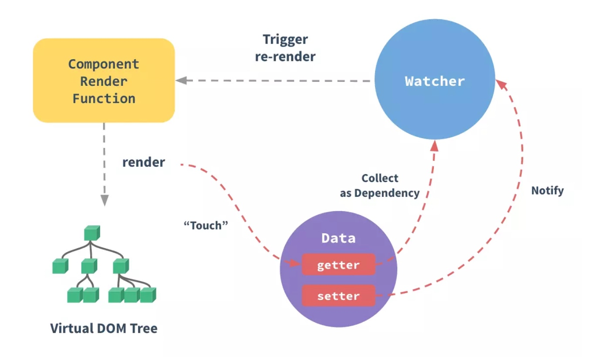

设计模式代表了最佳的实践，通常被有经验的面向对象的软件开发人员所采用。设计模式是软件开发人员在软件开发过程中面临的一般问题的解决方案。这些解决方案是众多软件开发人员经过相当长的一段时间的试验和错误总结出来的。
设计模式是一套被反复使用的、多数人知晓的、经过分类编目的、代码设计经验的总结。使用设计模式是为了重用代码、让代码更容易被他人理解、保证代码可靠性。 毫无疑问，设计模式于己于他人于系统都是多赢的，设计模式使代码编制真正工程化，设计模式是软件工程的基石，如同大厦的一块块砖石一样。
其实很多的设计模式是在日常的搬砖过程中一直在使用的，但是就是说不上名字，今天总结一下

## 观察者模式

对于观察者模式，这是一种非常常见的设计模式，在 ng 中的 emit，vue 中的事件总线，MVVM 等都是这种设计模式的体现。
我们拿 Vue 的这个来举例说明一下
在 Vue 中当我们修改了状态的时候，视图会随之更新，这就是 Vue 的双向绑定或者响应式原理。下图是官方的一张图

在 Vue 中每个组件都有自己的 watcher 实例对象，它会在组件渲染的过程中把属性记录为依赖，之后当记录项的 setter 被调用的时候，会通知 watcher 重新计算，从而导致它的视图的更新。这是一个典型的观察者模式。

Vue 实现双向绑定的过程中有如下的几个重要角色：

- observer 监听者 在 Vue 中的 obverser 不仅仅是一个监听者，它还可以对监听到的数据进行转发，也是一个发布者。
- watcher 观察者 obverser 把数据转发给了观察者 watcher 对象，watcher 接收到最新的对象以后就去更新视图
- compile 编译器 MVVM 框架特有的角色，负责对每个节点元素指令扫描和解析，指令的数据初始化，订阅者创建这些也是编译器在管的。

具体的流程图入下图所示

从上图看我们需要实现订阅者

## 工厂模式

工厂模式是设计模式中很常见的一种，比如最近的一个活，业务大概是这样的。
我们要创建一个存储卷，在创建的过程中有如下的几种参数：

1. 名字-字符串
2. 卷容量大小-大于 0 的整数
3. qos 参数-选择 qos 或者直接创建新的 qos
4. 存储池选择

上面的这几个参数在卷的生命周期中很多地方都要用到，比如在卷列表中有个修改卷的名称，那么创建和修改的校验逻辑就是一样的，同样的在 qos 列表中创建 qos 和编辑 qos 所需要的逻辑和创建卷的时候也是一样的。
那么这时候就需要有一个基础工厂，让我们把这部分的代码做成基类，然后通过继承让其他的组件继承这个基类，这时候其他组件中就有了名字校验，qos 相关的逻辑。如果别的地方继承了基类，但是有特殊的需要的话，就直接在自己的业务中进行添加，不去更新基类的代码。

工厂模式中有个很重要的点，就是工厂内的东西是属于公共的，不去参与工厂生成的业务的逻辑，而通过工厂继承的业务就可以去扩展工厂内的逻辑。所谓的封闭和开放。
也就是对自己（工厂内部）封闭，对外（继承工厂生成的业务组件）开放添加拓展逻辑

## 单列模式

**意图就是保证一个类只有一个实例，并在全局提供访问这个实例的方法。**

下面有个基础的 class 然后 new 一下会出来两个完全不一样的对象

```js
class TestSingleMode {
  constructor(name) {
    this.name = name;
  }

  hello() {
    console.log(this.name);
  }
}

const T1 = new TestSingleMode("T1");
const T2 = new TestSingleMode("T2");

T1 === T2; // false
```

因为在 new 的这个过程中，会完全开辟两个新的内存空间，去存放 T1 和 T2 这两个对象。所以不管是内容还是引用类型的地址，都是不一样的。这也是符合要求的。但是我们现在就想让这俩完全不一样的对象，变成引用地址是同一个，那么这就是单列模式的由来了。
单列模式有很多好处，比如 redux 的全局数据流，就是一种单列模式， state 里的数据是全局唯一，提供了修改 state 里面数据的方法，通过约定好的 action 去修改。还有像多人游戏的共享物品啊，也是要全局唯一的。给一个方法让所有的组件都可以去修改，修改完了以后其他的组件也可以得到修改完的数据。

```js
// 单列模式
class SignleMode {
  constructor() {
    this.number = 0;
  }
  static getInstance() {
    if (!this.instance) {
      SignleMode.instance = new SignleMode();
    }

    return SignleMode.instance;
  }

  add() {
    this.number += 1;
  }
}

const S1 = new SignleMode.getInstance(); //第一次的时候会检测有没有实例，没有的话就生成实例
const S2 = new SignleMode.getInstance(); // 这时候已经生成了实例，那么就直接使用这个实例，不再继续生成
// 这时候的 S1 === S2 ，其引用的地址是完全一样的。这时候 S1.add() 不管执行多少遍， S1.number === S2.number
```
