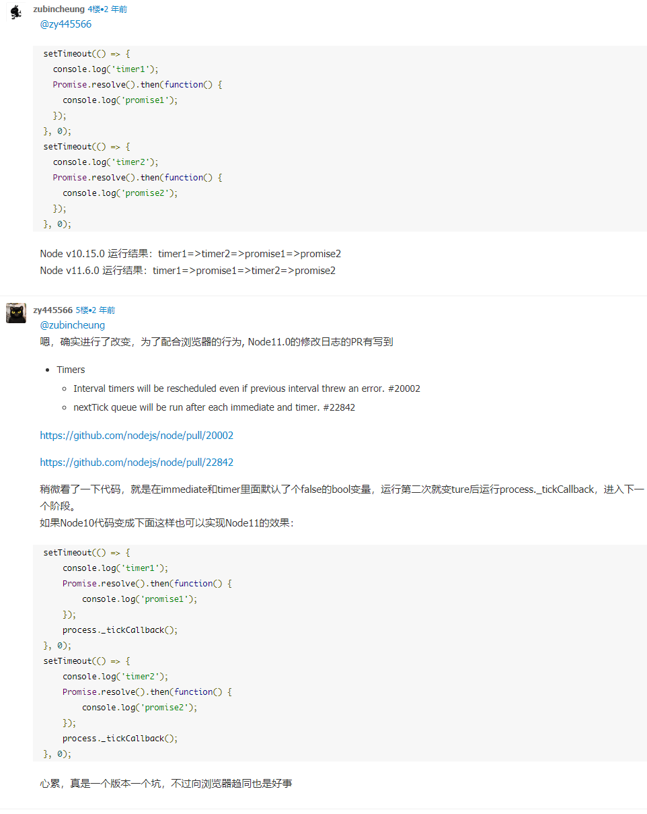

事件循环分浏览器和 node，大体上逻辑相似，但是内里逻辑又差别挺大的。
js 是单线程的，因为和它的用途有关系。js 设计的时候，就是为了和浏览器做交互使用的，在交互的时候，如果是多线程的话，就不知道 dom 究竟是听那个线程的操作了，如果两个线程一个前脚更新，一个后脚再变别的，究竟应该听谁的？所以设计和交互就决定了 js 是单线程的。为了利用多核的计算能力，出现了 web worker ，子线程是完全受主线程的控制的，而且不能操作 DOM，所以 JS 的单线程的特性是一直没发生变化的。

## 任务队列

单线程就意味着所有的任务都是要排队的，前一个任务结束了，后面的任务才可以开始，前一个任务在执行中，后面的任务就要继续等待。
任务分两种，一个是同步任务，一个是异步任务。

- 同步任务 在主线程上执行，执行完一个再执行下一个。
- 异步任务 不进入主线程，进入任务队列中，当任务队列通知主线程，这个任务现在可以被执行了，就会被放入主线程中执行

### 宏任务

在浏览器中，为了让 js 代码和 dom 有序的执行，会在一个宏任务执行完以后在一下个宏任务执行之前对页面进行渲染，也就是 宏任务 -> 渲染 -> 宏任务 这样的一循环。
宏任务有

```js
script 整体代码
setTimeout
setInterval
I/O
UI 交互事件
postMessage
MessageChannel
setImmediate（Node ）
```

### 微任务

在当前的宏任务执行完后立即执行的任务，在某个宏任务执行完成以后，就会马上把这个宏任务产生的微任务全部执行掉。

```js
Promise.then .... 等等的 promise 属性
Object.observe
MutationObserver
process.nextTick (node 环境)
```

Object.observe 是一个非常有意思的属性，一个异步监听 js 对象变化的方法

```js
// 假设我们这里有个数据模型
var model = {};

// 我们来对它进行监听
Object.observe(model, function (changes) {
  // 这个异步回调函数将被执行
  changes.forEach(function (change) {
    // 我们知道了都发生了哪些变化
    console.log(change.type, change.name, change.oldValue);
  });
});
```

## 浏览器

浏览器是执行完一个宏任务，马上就执行这个宏任务所产生的微任务。

## Node

Node 的事件循环是通过 libuv 实现的

```
   ┌───────────────────────────┐
┌─>│           timers          │
│  └─────────────┬─────────────┘
│  ┌─────────────┴─────────────┐
│  │     pending callbacks     │
│  └─────────────┬─────────────┘
│  ┌─────────────┴─────────────┐
│  │       idle, prepare       │
│  └─────────────┬─────────────┘      ┌───────────────┐
│  ┌─────────────┴─────────────┐      │   incoming:   │
│  │           poll            │<─────┤  connections, │
│  └─────────────┬─────────────┘      │   data, etc.  │
│  ┌─────────────┴─────────────┐      └───────────────┘
│  │           check           │
│  └─────────────┬─────────────┘
│  ┌─────────────┴─────────────┐
└──┤      close callbacks      │
   └───────────────────────────┘
```

Node 中的宏任务的执行顺序是这样的

- timers 定时器 本阶段执行已经安排的 setTimeout 和 setInterval 回调
- pending callbacks 待定回调，执行延迟到下个循环迭代的 I/O 回调。
- idle prepare 仅仅系统内部使用
- poll 轮询，检索新的 I/O 事件；执行与 I/O 相关的回调例如读取文件之类的，适当的条件下，node 会阻塞在这个阶段
- 检查阶段，执行 setImmediate 设定的 callback
- 关闭的回调函数，close callback 阶段，一些关闭的回调函数执行阶段，例如 socket.on('close', ...)

Node 和 浏览器不一样的地方在于，Node 执行微任务的时候，是在事件循环的间隙执行的。而且微任务就只有 promise.then 和 process.nextTick 且 process.nextTick 的优先级要高于 promise.then

浏览器和 Node 之间是有一些区别的，在 Node 10 以下的版本中是如下图


然而在 Node 11 的版本中却是这样的

