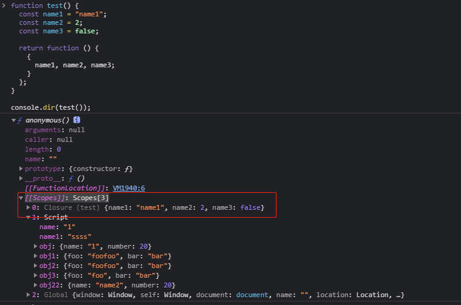

## 堆

堆可以理解为一个大篮子，存放任意数据结构的数据，操作系统不会管理堆里面放了什么，因此也不会主动去清除堆里的数据，在 C 语言里堆里的数据是要人工去干预处理的，Java js 等高级语言有了 GC ，用来协助处理堆里的变量问题。

## 栈

栈是内存中一块用于存储局部变量和函数参数的线性结构，遵循先进后出的原则。在栈里的数据，函数调用了以后，就会自己出栈，不需要程序自己操作，栈的特点就是轻量，不需要手动管理，函数调用的时候出现，调用结束就消失。

## 闭包

既然按照上面的说法，我们在一个函数里写的变量，在函数调用了以后，栈清空的时候，就会变量消失，那么闭包的被引用的变量却没有消失，那么闭包的这个变量去了哪里了，我们在控制台里写一个函数

```js
function test() {
  const name1 = "name1";
  const name2 = 2;
  const name3 = false;

  return function () {
    {
      name1, name2, name3;
    }
  };
}

console.dir(test());
```

当我们执行了 console.dir(test()) 的时候，就会产生闭包，按照上面说的，函数执行完以后，栈里的数据就会被清空，那么 name 这三个变量又去了哪里呢？

答案在我们打印出的 [[Scopes]]: Scopes[3] 这个对象里，说明闭包里面的对象是在堆里的，不是在栈里。

